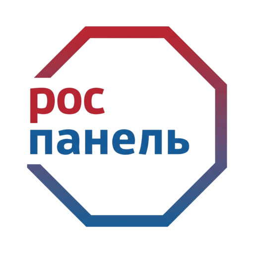
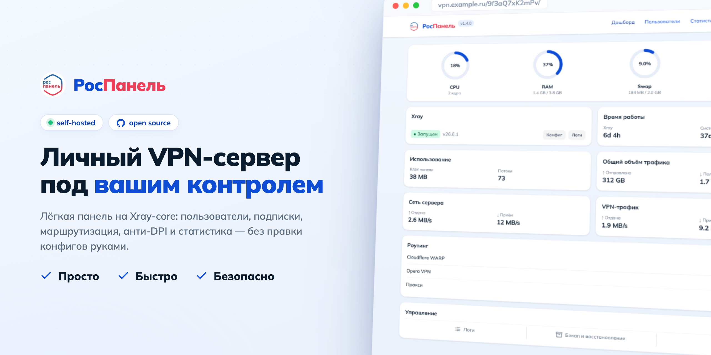
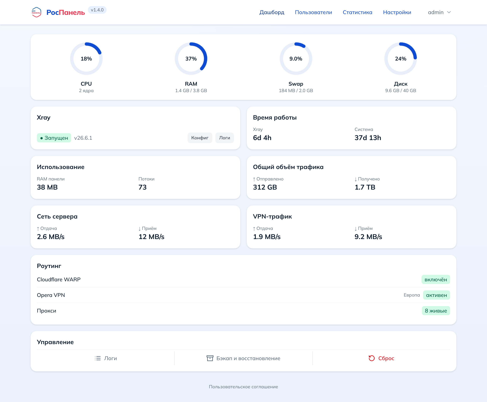
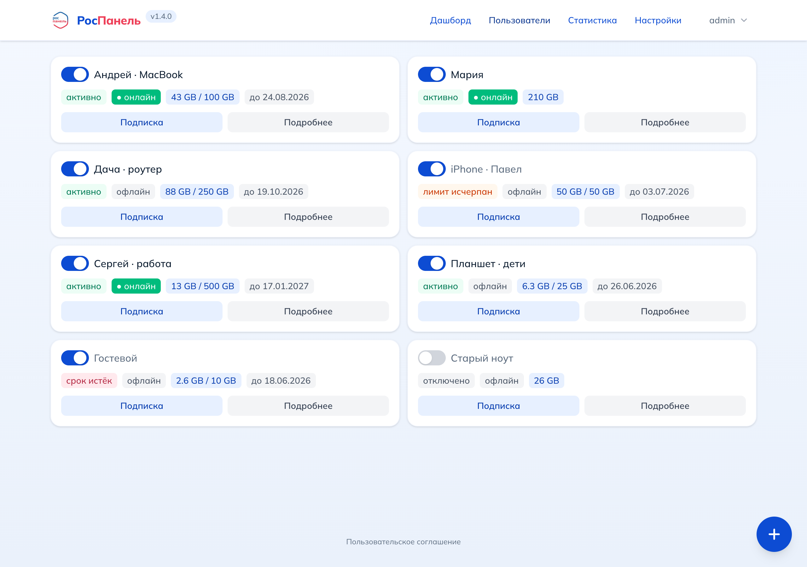
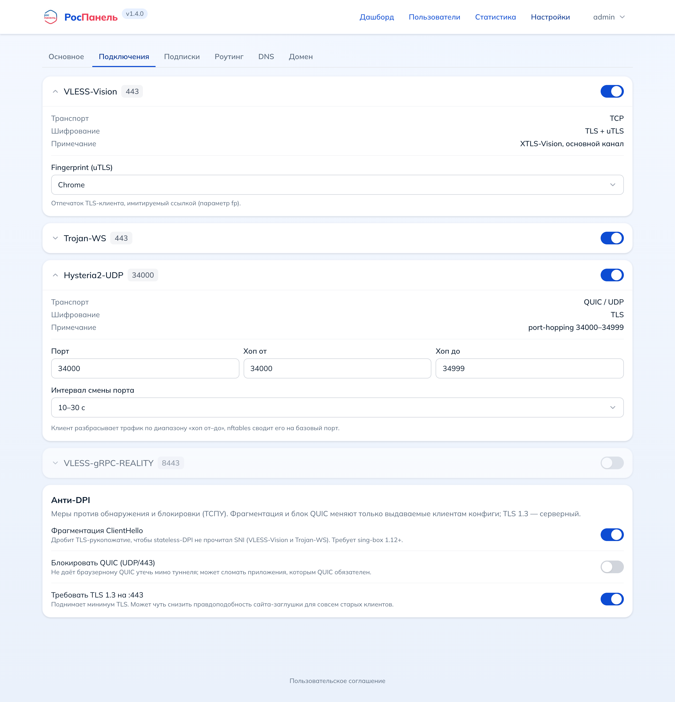
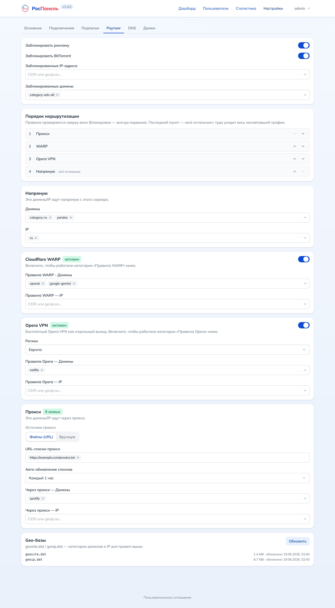

<div align="center">



# РосПанель

**Простая self-hosted панель управления VPN на Xray-core.**


<br>



</div>

---

## Что это

**РосПанель** — это лёгкая панель для самостоятельного хостинга личного VPN-сервера.
Под капотом один процесс [Xray-core](https://github.com/XTLS/Xray-core), который сразу
поднимает несколько протоколов, а панель даёт удобный веб-интерфейс: пользователи,
подписки, маршрутизация, статистика, бэкапы — без правки конфигов руками.

Главное отличие от Marzban / 3x-ui — **радикальная простота**: вся панель это
**один статический бинарник** (фронтенд вшит через `go:embed`), без Docker-обвязки,
без внешней БД, без отдельного веб-сервера. Поставил, открыл, добавил юзера.

> Это **панель управления** (control plane), а не VPN-клиент и не «волшебная кнопка».
> Она лишь настраивает и обслуживает ваш собственный сервер: генерирует конфиг Xray,
> выдаёт ссылки/подписки и показывает статистику. Назначение — образовательное и
> исследовательское: изучение сетевых технологий, CTF-соревнования, авторизованный
> пентест и управление личной инфраструктурой. Проект **не предназначен** для обхода
> законных ограничений; ответственность за установку, настройку и использование
> несёт оператор (см. [Дисклеймер](#-дисклеймер)).

---

## ✨ Возможности

#### 🔐 Протоколы (один Xray-конфиг, один набор учёток)

- **VLESS-Vision** — TCP/443 + uTLS-fingerprint
- **Trojan-WS** — через fallback на 443
- **Hysteria2** — UDP с port-hopping
- **VLESS-gRPC-REALITY** — отдельный порт, маскировка под чужой TLS

#### 🎭 Маскировка

- Панель спрятана за **секретным путём**
- Любой другой путь отдаёт **сайт-заглушку** — сервер неотличим от обычного хостинга
- 11 готовых шаблонов заглушек

#### 🔑 TLS из коробки

- **ACME**: Let's Encrypt и ZeroSSL
- Self-signed fallback, пока не выпустится настоящий сертификат
- Авто-продление

#### 🧭 Маршрутизация и выходы

- Категории **block / direct / proxy / WARP / Opera** с настраиваемым приоритетом
- **geosite/geoip** пресеты (авто-загрузка баз)
- **Cloudflare WARP** (WireGuard) — выход через WARP по правилам
- **Opera VPN** — бесплатный выход с выбором региона (Европа / Азия / Америка)
- **Прокси** — список из URL или вручную, балансировка по живым (Observatory)

#### 📊 Пользователи и статистика

- Лимиты трафика и срок действия с авто-отключением, авто-сброс (день/неделя/месяц/год)
- Учёт трафика через Xray Stats API, онлайн-статус, IP подключений
- **Дашборд**: CPU / RAM / swap / диск / сеть / VPN-трафик в реальном времени, аптайм

#### 📲 Подписки

- `/<путь>/<токен>` — base64-список + страница с QR и deep-links
- Кнопки импорта в популярные VPN-клиенты
- Авто-роутинг-заголовки (Happ / INCY / Mihomo)

#### 🤖 Telegram-бот

- Управление: список пользователей, добавление,
  удаление, вкл/выкл, сброс трафика, **QR-подписка** по юзеру
- **Бэкапы по расписанию** (cron) и по команде
- Привязка чата **одноразовым кодом** (`/start <код>`); бот отвечает только
  привязанным чатам

#### 🧰 Эксплуатация

- **Бэкап / восстановление** и сброс к заводским — из дашборда и из CLI
- **Логи приложения** с ротацией + просмотрщик прямо в панели
- **Брутфорс-защита**: бан по iptables за перебор на SOCKS/HTTP-инбаунде
- **Обновление** из GitHub Releases (`rospanel update`)
- Режим прокси: socks/http forward-inbound для цепочек РосПанель↔РосПанель

---

## 🚀 Быстрый старт

### Вариант 1 — установочный скрипт (рекомендуется)

Одной командой: скачает релиз, поставит systemd-сервис, запустит и покажет логин.

```bash
curl -Ls https://raw.githubusercontent.com/AppsGanin/rospanel/main/install.sh | sudo bash
```

Скрипт спросит домен: укажите его — панель запросит TLS-сертификат через ACME;
оставьте пустым — будет работать по IP.
Можно задать заранее, тогда вопроса не будет:
`curl -Ls … | sudo ROSPANEL_HOST=vpn.example.com bash`.

Xray, geo-базы и TLS-сертификат панель подтянет сама. Откройте
`https://<ваш-домен-или-IP>/<секрет>/` и войдите. Поддерживаются `linux/amd64`
и `linux/arm64` — скрипт сам выберет нужный бинарь по архитектуре.

### Вариант 2 — бинарник + systemd вручную

```bash
# скачать последний релиз (замените amd64 на arm64 для ARM-серверов)
curl -fsSL -o rospanel \
  https://github.com/AppsGanin/rospanel/releases/latest/download/rospanel-linux-amd64
chmod +x rospanel

# установить как сервис (копирует бинарь в /usr/local/bin, пишет systemd-юнит, стартует)
sudo ./rospanel install
#   сразу с доменом:  sudo ROSPANEL_HOST=vpn.example.com ./rospanel install

# логин и секретный путь печатаются ОДИН раз:
journalctl -u rospanel | grep -A6 FIRST-RUN
```

### Вариант 3 — Docker

```bash
docker run -d --name rospanel \
  --network host \
  --cap-add NET_ADMIN \
  -v rospanel-data:/data \
  ghcr.io/appsganin/rospanel:latest

docker logs rospanel | grep -A6 FIRST-RUN
```

> `--network host` нужен, чтобы Xray слушал 443/TCP, 80/TCP и UDP-порты Hysteria2 напрямую;
> `NET_ADMIN` — для port-hopping и бана по iptables.

### 🔑 Вход по умолчанию

| Поле        | Значение     |
| ----------- | ------------ |
| Логин       | `admin`      |
| Пароль      | `admin`      |
| Путь панели | `/rospanel/` |

То есть сразу после установки панель доступна по адресу `https://<домен-или-IP>/rospanel/`.
Точная ссылка дублируется в логе (`journalctl -u rospanel | grep -A6 FIRST-RUN`
или `docker logs rospanel | grep -A6 FIRST-RUN`).

При первом входе мастер настройки **принудительно потребует сменить пароль** и
предложит **сменить путь панели на случайный секрет** — дефолтные `admin/admin` и
`/rospanel/` работают только до этого шага.

> ⚠️ После смены панель доступна **только по секретному пути** — корень отдаёт
> страницу-обманку. Без знания `/<secret>/` форму логина не найти.

---

## 🖥️ Скриншоты (Mock)

<br><sub><b>Дашборд</b> — ресурсы сервера, VPN-трафик и статус выходов в реальном времени</sub>

<br><sub><b>Пользователи</b> — лимиты, срок действия, онлайн-статус, ссылка на подписку</sub>

<br><sub><b>Подключения</b> — настроийка протоколов</sub>

<br><sub><b>Маршрутизация</b> — порядок выходов (proxy / WARP / Opera / direct), geosite/geoip-правила,прокси</sub>

---

## 🛠️ CLI

```text
rospanel                     запустить панель (обычно через systemd)
rospanel install             установить systemd-сервис и запустить (root)
rospanel uninstall [-y]      снять сервис (данные сохраняются)
rospanel start|stop|restart  управление сервисом
rospanel status              статус сервиса
rospanel update [-y]         обновиться до последнего релиза с GitHub
rospanel backup [файл]       снапшот .tar.gz (БД + сертификаты + конфиг Xray)
rospanel restore [-y] <файл> восстановить из снапшота (применится при старте)
rospanel host [-y] [домен|IP] показать/сменить адрес (перевыпуск TLS)
rospanel reset [-y]          сброс к заводским настройкам (стирает БД)
rospanel version             версия
rospanel help                полная справка
```

Деструктивные команды (`reset`, `restore`, `host`, `uninstall`) спрашивают
подтверждение; флаг `-y` его пропускает.

---

## 🧱 Архитектура

Единственный источник правды — **SQLite**; конфиг Xray всегда генерируется из неё
и применяется супервизором. Веб-панель встроена в бинарник.

```
cmd/rospanel/        запуск сервера + CLI (main / service / cli)
internal/
  model/             доменные типы (User, Settings, RoutingConfig, …)
  store/             SQLite + миграции
  auth/              argon2id, секреты/токены, сессии
  tlsmgr/ tlsutil/   ACME (Let's Encrypt / ZeroSSL) + self-signed
  decoy/             сайт-заглушка (шаблоны)
  geo/               geoip.dat / geosite.dat
  hop/               nftables port-hopping (Hysteria2)
  xray/              типизированный конфиг + генератор + supervisor + stats
  warp/              Cloudflare WARP (WireGuard outbound)
  opera/             хелпер Opera VPN (загрузка бинаря + supervisor)
  proxypool/         пул прокси + health-check (Observatory)
  proxyproto/        PROXY-протокол листенер (реальный IP клиента)
  logbuf/            кольцевой лог-буфер + ротация в файл
  link/ sub/         сборка ссылок и подписок
  backup/            tar.gz снапшоты
  updater/           обновление из GitHub
  sysstat/ netinfo/  метрики хоста + определение публичного IP
  tuning/            включение TCP BBR
  core/              сервисный слой (reconcile, квоты, TLS, трафик, роутинг)
  server/            маскировка-роутер + API + rate-limit
web/                 React + Vite + Tailwind (встраивается через go:embed)
install.sh           установщик: релизный бинарь + systemd-юнит (`rospanel install`)
```

**Стек:** Go 1.26 · Xray-core · SQLite (modernc, без CGO) · React + Vite + Tailwind.

---

## ⚠️ Дисклеймер

Программное обеспечение предоставляется «как есть» (as is), без каких-либо
гарантий, явных или подразумеваемых.

**Назначение проекта — образовательное и исследовательское.** Он создан для
изучения принципов работы сетевых протоколов, TLS и прокси-технологий; для
проведения **CTF-соревнований** и лабораторных работ по сетевой безопасности;
для **авторизованного** тестирования на проникновение и для управления
**собственной** инфраструктурой. Это учебный и исследовательский инструмент,
а не средство для какой-либо противоправной деятельности.

Проект **не предназначен** для обхода законных ограничений, нарушения
законодательства или иных противоправных действий. Реализованные механизмы
маскировки служат для изучения соответствующих технологий и проверки
устойчивости сетевых сервисов в рамках санкционированного тестирования.

Всю ответственность за установку, настройку и эксплуатацию, а также за
соблюдение законов своей юрисдикции несёт **оператор сервера**. Авторы и
контрибьюторы проекта не несут ответственности за способы его использования
третьими лицами.

---

## 🧑‍💻 Разработка

```bash
# фронтенд (после изменений в web/)
npm --prefix web install
npm --prefix web run build      # → web/dist (вшивается в бинарник)

# бинарник
go build -o rospanel ./cmd/rospanel
./rospanel
```

Полезные переменные окружения (все опциональны): `ROSPANEL_DATA` (каталог данных),
`ROSPANEL_ADMIN_ADDR` (loopback-адрес панели, по умолчанию `127.0.0.1:8080`),
`XRAY_BIN`, `ROSPANEL_HOST`, `ROSPANEL_ACME_EMAIL`.

PR и issue приветствуются. Коммиты — в стиле [Conventional Commits](https://www.conventionalcommits.org/):
на их основе release-please собирает релиз и публикует бинарь + Docker-образ в GHCR.

---

## 💝 Поддержать проект

РосПанель развивается в свободное время и распространяется бесплатно. Если панель оказалась полезной — можно поддержать разработку.

Удобнее всего — через **[Boosty](https://boosty.to/githubapps)** (картой РФ, разово или регулярно). Либо донатом в USDT — выберите удобную
сеть и **внимательно** скопируйте адрес (сеть отправителя и получателя должны совпадать):

| Сеть             | Токен | Адрес                                              |
| ---------------- | ----- | -------------------------------------------------- |
| TRC20 (Tron)     | USDT  | `TJwyrPVEZVZ1YrcmDiZTyFjLo3Q2DmEGzs`               |
| ERC20 (Ethereum) | USDT  | `0xf9d663146ce902da91911b214c71cc73a5269d1d`       |
| Solana           | USDT  | `2qAZRTbaUMTfYuZbD1dCYHjkYgxkw4dUYE9XY3JhC2Cs`     |
| TON              | USDT  | `UQDoat731MLYuIw8ayL3Vhhw7zTBbLvRaQFmDvab--CNNI7e` |

Если у вас тоже Bybit — проще всего перевести по **UID** (мгновенно и без комиссии):

| Биржа | UID         |
| ----- | ----------- |
| Bybit | `136462734` |

> Дешевле всего комиссия в сетях **TRON (TRC20)** и **TON**. Отправляйте только
> **USDT** и только в указанной сети — перевод по неверной сети невозвратен.

Спасибо за поддержку! 🙏

### Нет возможности поддержать?

Если поддержать проект напрямую не получается — вы всё равно можете помочь, арендуя серверы по этим реферальным ссылкам:

- [VDSina](https://www.vdsina.com/?partner=nmzki7z7tu)
- [Aeza](https://aeza.net/?ref=375522)
- [NetGrid](https://netgrid.host/ru?from=3491)
- [Serv.host](https://serv.host/?from=36809)
- [u1Host](https://u1host.com/?from=7702)
- [Waicore](https://waicore.net/?from=35607)

---

## 📄 Лицензия

[GNU Affero General Public License v3.0](LICENSE) (AGPL-3.0).

Проект свободен для использования, изменения и self-hosting. Если вы предоставляете доступ к изменённой версии панели по сети (в т.ч. как сервис), вы обязаны открыть исходный код своих изменений на тех же условиях.
