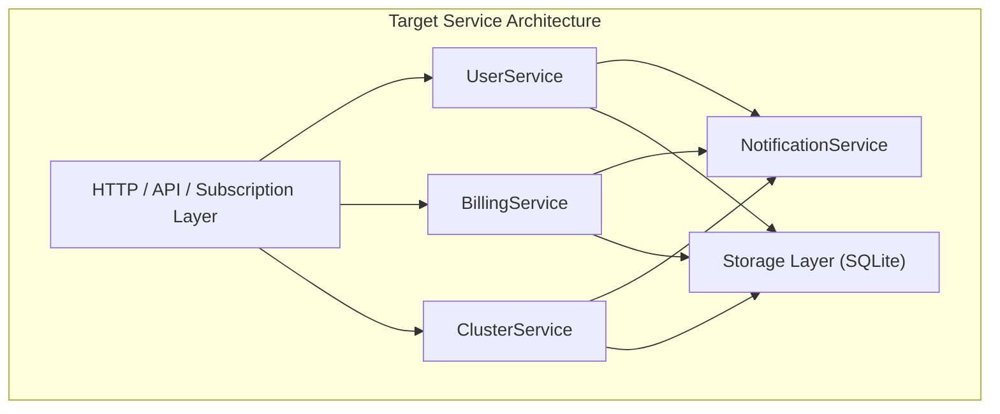

# 🛠 Детальный план исправлений и улучшений (Code Review Action Items)

> **Проект:** RosPanel  
> **Версия Go:** 1.26.6  
> **Роль:** Senior / Staff Systems Engineer  
> **Дата:** 2026-08-23  
> **Назначение документа:** Пошаговое техническое руководство для команды по исправлению выявленных архитектурных, логических и инфраструктурных проблем.

---

## Оглавление

1. [Критические проблемы (Critical / P0)](#1-критические-проблемы-critical--p0)
   - [CRIT-1: Неполная проверка зашифрованных колонок в datasec.go](#crit-1-неполная-проверка-зашифрованных-колонок-в-datasecgo)
   - [CRIT-2: Пропуск зашифрованных полей в ReencryptSensitiveFields](#crit-2-пропуск-зашифрованных-полей-в-reencryptsensitivefields)
2. [Проблемы высокого приоритета (High / P1)](#2-проблемы-высокого-приоритета-high--p1)
   - [HIGH-1: O(N) агрегация ActiveDeviceCounts при каждом запросе подписки](#high-1-on-агрегация-activedevicecounts-при-каждом-запросе-подписки)
   - [HIGH-2: Синхронная блокировка обработчиков при отправке Telegram-уведомлений](#high-2-синхронная-блокировка-обработчиков-при-отправке-telegram-уведомлений)
   - [HIGH-3: Отсутствие валидации коллизий динамических путей в настройках](#high-3-отсутствие-валидации-коллизий-динамических-путей-в-настройках)
   - [HIGH-4: Грубая остановка Xray через SIGKILL без graceful shutdown](#high-4-грубая-остановка-xray-через-sigkill-без-graceful-shutdown)
3. [Проблемы среднего и низкого приоритета (Medium & Low / P2-P3)](#3-проблемы-среднего-и-низкого-приоритета-medium--low--p2-p3)
   - [MED-1: Ошибка сборки и тестирования на чистом клоне из-за web/embed.go](#med-1-ошибка-сборки-и-тестирования-на-чистом-клоне-из-за-webembedgo)
   - [MED-2: Блокировка чтения при тяжелых выборках на db.SetMaxOpenConns(1)](#med-2-блокировка-чтения-при-тяжелых-выборках-на-dbsetmaxopenconns1)
   - [MED-3: Дублирование вспомогательных функций в разных пакетах](#med-3-дублирование-вспомогательных-функций-в-разных-пакетах)
   - [LOW-1: Нагрузка на CPU при параллельных попытках логина (Argon2id)](#low-1-нагрузка-на-cpu-при-параллельных-попытках-логина-argon2id)
4. [Архитектурный рефакторинг и технический долг](#4-архитектурный-рефакторинг-и-технический-долг)
   - [ARCH-1: Декомпозиция монолитной структуры core.Manager](#arch-1-декомпозиция-монолитной-структуры-coremanager)
   - [ARCH-2: Изоляция зависимостей и унификация интерфейсов](#arch-2-изоляция-зависимостей-и-унификация-интерфейсов)
5. [Сводная таблица задач и очередность внедрения](#5-сводная-таблица-задач-и-очередность-внедрения)

---

## 1. Критические проблемы (Critical / P0)

### CRIT-1: Неполная проверка зашифрованных колонок в `datasec.go`

- **Локация:** [`internal/datasec/datasec.go:94-142`](file:///Users/shu1t3/Documents/rospanel-shu1t3/internal/datasec/datasec.go#L94-L142)
- **Суть проблемы:**  
  Функция `dbHasEncryptedSecrets` предназначена для предотвращения перезаписи мастер-ключа шифрования `secrets.key`, если база данных уже содержит данные, зашифрованные старым ключом. Сейчас она проверяет только фиксированный список из 13 SQL-запросов (`settings`, `nodes`, `users.password`, `admins.totp_secret`).  
  При этом в схеме присутствуют **другие таблицы и колонки**, содержащие шифрованные секреты с префиксом `enc:v1:`:
  1. `webhooks.secret`
  2. `payment_providers.config`
  3. `inbounds.reality_private_key`
  4. `config_snapshots.config_json`
  5. `admins.totp_pending`
- **Сценарий отказа:**  
  Если в системе созданы кастомные входящие Reality-подключения или настроены платежные провайдеры (при этом у пользователей нет зашифрованных паролей, а у админа нет TOTP), и файл `secrets.key` случайно отсутствует/удален, `dbHasEncryptedSecrets` вернет `false`. `datasec.Init` сгенерирует **новый ключ**, перезапишет файл, и все конфигурации провайдеров / Reality ключи станут навсегда нечитаемыми (`cipher: message authentication failed`).
- **Предлагаемое решение:**  
  Дополнить массив `queries` всеми зашифрованными полями базы данных:

```go
// internal/datasec/datasec.go
queries := []string{
    `SELECT 1 FROM settings WHERE tg_bot_token LIKE 'enc:v1:%' LIMIT 1`,
    `SELECT 1 FROM settings WHERE tg_user_bot_token LIKE 'enc:v1:%' LIMIT 1`,
    `SELECT 1 FROM settings WHERE tg_support_bot_token LIKE 'enc:v1:%' LIMIT 1`,
    `SELECT 1 FROM settings WHERE zerossl_eab_hmac LIKE 'enc:v1:%' LIMIT 1`,
    `SELECT 1 FROM settings WHERE warp_private_key LIKE 'enc:v1:%' LIMIT 1`,
    `SELECT 1 FROM settings WHERE panel_reality_key LIKE 'enc:v1:%' LIMIT 1`,
    `SELECT 1 FROM nodes WHERE reality_private_key LIKE 'enc:v1:%' LIMIT 1`,
    `SELECT 1 FROM nodes WHERE warp_private_key LIKE 'enc:v1:%' LIMIT 1`,
    `SELECT 1 FROM nodes WHERE zerossl_eab_hmac LIKE 'enc:v1:%' LIMIT 1`,
    `SELECT 1 FROM nodes WHERE proxy_accounts LIKE 'enc:v1:%' LIMIT 1`,
    `SELECT 1 FROM users WHERE password LIKE 'enc:v1:%' LIMIT 1`,
    `SELECT 1 FROM admins WHERE totp_secret LIKE 'enc:v1:%' LIMIT 1`,
    `SELECT 1 FROM admins WHERE totp_pending LIKE 'enc:v1:%' LIMIT 1`,
    `SELECT 1 FROM webhooks WHERE secret LIKE 'enc:v1:%' LIMIT 1`,
    `SELECT 1 FROM payment_providers WHERE config LIKE 'enc:v1:%' LIMIT 1`,
    `SELECT 1 FROM inbounds WHERE reality_private_key LIKE 'enc:v1:%' LIMIT 1`,
    `SELECT 1 FROM config_snapshots WHERE config_json LIKE 'enc:v1:%' LIMIT 1`,
}
```

- **Критерии приемки:**
  - Написан тест в `datasec_test.go`, создающий БД только с зашифрованным `webhooks.secret` или `payment_providers.config`.
  - `dbHasEncryptedSecrets` возвращает `true`.
  - `Init` возвращает `ErrKeyMismatch`, если файл ключа отсутствует, предотвращая перезапись.

---

### CRIT-2: Пропуск зашифрованных полей в `ReencryptSensitiveFields`

- **Локация:** [`internal/store/reencrypt.go:21-82`](file:///Users/shu1t3/Documents/rospanel-shu1t3/internal/store/reencrypt.go#L21-L82)
- **Суть проблемы:**  
  Процедура миграции открытых полей в зашифрованные шифрует только пароли пользователей, настройки, TOTP администратора и конфигурации платежных провайдеров. Она **не обрабатывает**:
  - `nodes.reality_private_key`
  - `nodes.warp_private_key`
  - `nodes.zerossl_eab_hmac`
  - `nodes.proxy_accounts`
  - `webhooks.secret`
  - `inbounds.reality_private_key`
- **Сценарий отказа:**  
  При импорте legacy-бэкапа или миграции со старых версий приватные ключи нод, секреты вебхуков и Reality-ключи кастомных портов остаются в БД в открытом виде (plaintext).
- **Предлагаемое решение:**  
  Добавить в `ReencryptSensitiveFields` обход таблиц `nodes`, `webhooks`, `inbounds`:
  ```go
  // internal/store/reencrypt.go
  // Обход nodes:
  // reality_private_key, warp_private_key, zerossl_eab_hmac, proxy_accounts
  // Обход webhooks: secret
  // Обход inbounds: reality_private_key
  ```
- **Критерии приемки:**
  - В тесте `reencrypt_test.go` проверяется, что после вызова `ReencryptSensitiveFields` в таблицах `nodes`, `webhooks` и `inbounds` не остается строк с непустыми секретами без префикса `enc:v1:`.

---

## 2. Проблемы высокого приоритета (High / P1)

### HIGH-1: O(N) агрегация `ActiveDeviceCounts` при каждом запросе подписки

- **Локация:** [`internal/store/users.go:560-611`](file:///Users/shu1t3/Documents/rospanel-shu1t3/internal/store/users.go#L560-L611), [`internal/store/stats.go:379-399`](file:///Users/shu1t3/Documents/rospanel-shu1t3/internal/store/stats.go#L379-L399)
- **Суть проблемы:**  
  Функция `queryUsers` вызывает `applyUserStatus(users)`. Внутри нее вызывается `s.ActiveDeviceCounts(now - DeviceOnlineWindow)`.  
  Этот метод делает `SELECT user_id, COUNT(DISTINCT ip) FROM connections ... GROUP BY user_id` по **всей таблице `connections`**.  
  Это происходит даже при точечном вызове `GetUser(id)` или `GetUserBySubToken(token)` для одного пользователя.  
  При тысячах пользователей и serialized SQLite (`SetMaxOpenConns(1)`) каждый входящий HTTP-запрос подписки (Clash/Sing-box/V2Ray) блокирует единственное соединение базы данных на время выполнения полного сканирования таблицы сессий.
- **Предлагаемое решение:**
  1. Реализовать точечный метод `ActiveDeviceCountForUser(userID int64, since int64) (int, error)`:
     ```sql
     SELECT COUNT(DISTINCT ip) FROM connections 
     WHERE user_id = ? AND last_seen > ?
     ```
  2. В `applyUserStatus` для `len(users) == 1` вызывать точечный подсчет.
  3. Для списков пользователей кешировать результат `ActiveDeviceCounts` в памяти с коротким TTL (10–15 секунд), так как окно активности устройств составляет 5 минут (`DeviceOnlineWindow = 300`).
- **Критерии приемки:**
  - Одиночный запрос `GetUserBySubToken` не выполняет группировку всей таблицы `connections`.
  - Время ответа эндпоинта подписки под нагрузкой сокращается в 5-10 раз при заполненной таблице `connections`.

---

### HIGH-2: Синхронная блокировка обработчиков при отправке Telegram-уведомлений

- **Локация:** [`internal/core/manager_notify.go:49-61`](file:///Users/shu1t3/Documents/rospanel-shu1t3/internal/core/manager_notify.go#L49-L61), [`internal/telegram/bot.go:160-186`](file:///Users/shu1t3/Documents/rospanel-shu1t3/internal/telegram/bot.go#L160-L186)
- **Суть проблемы:**  
  Вызов `notifyAdminEvent` (оплата, вебхук, регистрация, падение Xray) синхронно вызывает функцию `adminNotify`.  
  Внутри `bot.go` запускается последовательный цикл отправки сообщений по всем админским чатам:
  ```go
  for _, id := range chats {
      if err := c.SendMessage(context.Background(), id, html); err != nil { ... }
  }
  ```
  `SendMessage` ожидает слот рейт-лимитера (`waitSlot`) и обрабатывает 429 Retry-After с задержкой до десятков секунд.  
  Входящий HTTP-запрос (например, вебхук оплаты от ЮKassa или CryptoBot) оказывается заблокирован на все время сетевого взаимодействия с Telegram.
- **Предлагаемое решение:**  
  Сделать отправку уведомлений неблокирующей:
  ```go
  // internal/telegram/bot.go:178
  go func(chatIDs []int64, client *Client, msg string) {
      for _, id := range chatIDs {
          if err := client.SendMessage(context.Background(), id, msg); err != nil {
              log.Printf("telegram: admin notify to %d failed: %v", id, err)
          }
      }
  }(chats, c, html)
  ```
  Либо использовать буферизированный канал событий для очереди уведомлений.
- **Критерии приемки:**
  - Обработка входящего вебхука платежа завершается за < 50ms независимо от сетевой доступности Telegram Bot API.

---

### HIGH-3: Отсутствие валидации коллизий динамических путей в настройках

- **Локация:** [`internal/core/manager_settings.go:643-670`](file:///Users/shu1t3/Documents/rospanel-shu1t3/internal/core/manager_settings.go#L643-L670), [`internal/server/server.go:240-370`](file:///Users/shu1t3/Documents/rospanel-shu1t3/internal/server/server.go#L240-L370)
- **Суть проблемы:**  
  В методе `SaveSubSettings` проверяется несовпадение `SubPath` с `PanelSecretPath` и статическими путями. Однако не проверяется пересечение с:
  - `APIPath` (секретный префикс админ-API)
  - `NodeAPIPath` (секретный префикс синхронизации нод)
  - `StatusPath` (секретный статус-эндпоинт)
- **Сценарий отказа:**  
  Если случайно или намеренно задать одинаковые префиксы (например, для маскировки), роутер `ServeHTTP` перехватит запросы на первом совпавшем условии `strings.HasPrefix`, сделав подписки или ноды полностью недоступными.
- **Предлагаемое решение:**  
  Добавить строгую проверку уникальности всех 4 динамических секретных путей в `manager_settings.go`:
  ```go
  paths := map[string]string{
      "SubPath": st.SubPath,
      "PanelPath": st.PanelSecretPath,
      "APIPath": st.APIPath,
      "NodeAPIPath": st.NodeAPIPath,
      "StatusPath": st.StatusPath,
  }
  // Проверить, что ни один не является префиксом другого
  ```
- **Критерии приемки:**
  - Попытка сохранить пересекающийся путь возвращает локализованную ошибку валидации.

---

### HIGH-4: Грубая остановка Xray через SIGKILL без graceful shutdown

- **Локация:** [`internal/xray/supervisor.go:933-946`](file:///Users/shu1t3/Documents/rospanel-shu1t3/internal/xray/supervisor.go#L933-L946)
- **Суть проблемы:**  
  При вызове `stopProc()` (во время перезагрузки конфигурации, обновления TLS или по кнопке рестарта) вызывается:
  ```go
  _ = p.cmd.Process.Kill()
  <-p.done
  ```
  `Process.Kill()` посылает сигнал `SIGKILL` (SIGKILL не перехватывается процессом).  
  В этот момент все активные соединения клиентов (TCP-буферы, TLS handshakes, QUIC потоки) обрываются жестко.
- **Предлагаемое решение:**  
  Реализовать двухфазную остановку:
  1. Послать `syscall.SIGTERM` процессу.
  2. Ожидать завершения в течение 1000ms.
  3. Если процесс не завершился — выполнить `Process.Kill()`.
- **Критерии приемки:**
  - При плановом перезапуске Xray завершает активные сокеты штатно, минимизируя сбросы соединений.

---

## 3. Проблемы среднего и низкого приоритета (Medium & Low / P2-P3)

### MED-1: Ошибка сборки и тестирования на чистом клоне из-за `web/embed.go`

- **Локация:** `web/embed.go:11`
- **Суть:**  
  Директива `//go:embed all:dist` ломает вызовы `go test ./...` и `go vet ./...` на чистом git-репозитории, если папка `web/dist` не скомпилирована через npm.
- **Решение:**  
  Создать и закоммитить файл-заглушку `web/dist/index.html` или `.gitkeep`.
- **Критерии приемки:**
  - `git clone` на чистой машине с установленным только Go позволяет сразу запустить `go test ./...` без ошибок компилятора.

---

### MED-2: Блокировка чтения при тяжелых выборках на `db.SetMaxOpenConns(1)`

- **Локация:** [`internal/store/store.go:28-40`](file:///Users/shu1t3/Documents/rospanel-shu1t3/internal/store/store.go#L28-L40)
- **Суть:**  
  Ограничение в 1 коннект устраняет гонки записи в SQLite, но длительные операции чтения (создание бэкапа `SendBackup`, сбор статистики `PaymentStats`) блокируют на 1-3 секунды операции аутентификации и синхронизации нод.
- **Решение:**  
  Разделить соединения на пул для чтения (`MaxOpenConns = 4` с `WAL` режимом) и отдельный мьютекс на запись, либо вынести тяжелые выборки статистики в read-only транзакции.

---

### MED-3: Дублирование вспомогательных функций в разных пакетах

- **Локации:**
  - `escHTML` в `internal/telegram/format.go`, `internal/core/manager_notify.go`, `internal/core/manager_billing.go`
  - `truncateName`, `min`, `max` в `internal/nodeagent/agent.go`, `internal/server/panel.go`, `internal/xray/supervisor.go`
- **Решение:**  
  Создать пакет `internal/strutil` и вынести общие функции форматирования и экранирования.

---

### LOW-1: Нагрузка на CPU при параллельных попытках логина (Argon2id)

- **Локация:** [`internal/server/panel.go:375-430`](file:///Users/shu1t3/Documents/rospanel-shu1t3/internal/server/panel.go#L375-L430)
- **Суть:**  
  Параллельная отправка запросов на `/api-xxx/login` с неверными паролями заставляет сервер параллельно вычислять Argon2id (`64 MiB`, 3 итерации), что способно нагрузить CPU до 100%.
- **Решение:**  
  Внедрить семафор на одновременные вычисления Argon2id (например, `maxConcurrentAuth = 3`), отдавая `HTTP 429` при превышении очереди.

---

## 4. Архитектурный рефакторинг и технический долг

### ARCH-1: Декомпозиция монолитной структуры `core.Manager`

- **Локация:** `internal/core/manager_*.go` (14 файлов)
- **Суть проблемы:**  
  Пакет `core` содержит одну гигантскую структуру `Manager`, объединяющую более 100 методов. Это усложняет модульное тестирование и создает клубок mutex-блокировок (`applyPlanMu`, `notifyMu`, `throttleMu`).
- **Целевая архитектура:**  
  Постепенно выделить специализированные подсервисы:
  - `core.UserService` (управление пользователями, ключами, статусами)
  - `core.BillingService` (тарифы, заказы, платежные шлюзы)
  - `core.ClusterService` (ноды, синхронизация, desired state)
  - `core.NotificationService` (маршрутизация Telegram и webhook событий)



---

## 5. Сводная таблица задач и очередность внедрения

| ID | Приоритет | Категория | Трудоемкость | Влияние | Описание |
| :--- | :---: | :---: | :---: | :---: | :--- |
| **CRIT-1** | **P0** | Security / Data Loss | 0.5 дня | Критическое | Добавить недостающие таблицы в `dbHasEncryptedSecrets` |
| **CRIT-2** | **P0** | Security | 0.5 дня | Высокое | Дополнить шифрование полей в `ReencryptSensitiveFields` |
| **HIGH-1** | **P1** | Performance | 1 день | Высокое | Точечный подсчет устройств вместо full-table scan в `GetUser` |
| **HIGH-2** | **P1** | Reliability | 0.5 дня | Высокое | Асинхронная отправка уведомлений Telegram в `notifyAdminEvent` |
| **HIGH-3** | **P1** | Bug / Routing | 0.5 дня | Среднее | Валидация коллизий секретных путей в `manager_settings.go` |
| **HIGH-4** | **P1** | Network / UX | 0.5 дня | Среднее | Graceful `SIGTERM` перед `SIGKILL` в супервизоре Xray |
| **MED-1** | **P2** | DX / CI | 0.2 дня | Среднее | Добавить `web/dist/index.html` stub для чистого билда |
| **MED-2** | **P2** | Performance | 1-2 дня | Среднее | Оптимизация пула подключений SQLite для параллельного чтения |
| **MED-3** | **P3** | Code Quality | 0.5 дня | Низкое | Вынос повторяющихся функций в `internal/strutil` |
| **LOW-1** | **P3** | DoS Protection | 0.5 дня | Низкое | Семафор параллельных вычислений Argon2id |
| **ARCH-1** | **P3** | Refactoring | 3-5 дней | Долгосрочное | Декомпозиция `core.Manager` на доменные сервисы |

---

## 6. Команды для валидации изменений

Перед отправкой изменений в основную ветку обязательно выполнение следующих проверок:

```bash
# 1. Проверка синтаксиса и статического анализа
go vet ./...

# 2. Прогон всех тестов с детектором гонок
go test -race ./...

# 3. Запуск линтеров (если установлен golangci-lint)
golangci-lint run ./...

# 4. Проверка сборки бинарных файлов (panel и node)
go build -v -o /dev/null ./cmd/rospanel
```
